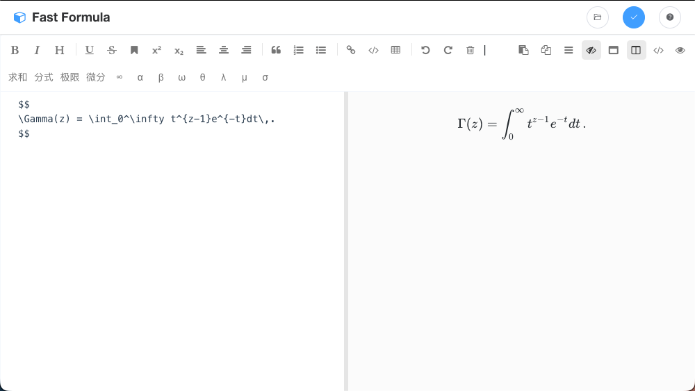

# Fast Formula ⚡️

> 一个基于 Markdown 和 LaTeX 的高效数学公式编辑器，专为快速编写、预览和导出公式而设计。

Fast Formula 是一款跨平台的桌面应用，旨在简化数学公式的编写流程。无论你是学生、教师还是科研人员，都可以通过它轻松创建精美的数学公式，并无缝导出到 Word 或其他文档中。

## ✨ 主要功能

*   **实时预览**: 使用 Markdown 语法编写，实时渲染 LaTeX 公式。
*   **公式管理**: 支持保存常用公式，方便日后检索和修改。
*   **一键导出**:
    *   复制为 MathML 格式（可直接粘贴到 Microsoft Word）。
    *   复制为 LaTeX 源码。
*   **快捷输入**: 内置常用数学符号面板，点击即可插入。
*   **全局快捷键**: 支持 `Ctrl+o` (Windows/Linux) / `Cmd+o` (macOS) 快速唤醒窗口。
*   **跨平台**: 支持 Windows, macOS 和 Linux。

## 🛠️ 技术栈

*   **Electron**: v13.x
*   **Vue.js**: v2.x
*   **MathJax**: 用于公式渲染
*   **Nedb**: 本地数据存储

## 🚀 快速开始

### 环境要求

*   Node.js (推荐 v14+，本项目已适配 v24+ 配合 legacy provider)
*   npm 或 yarn

### 安装依赖

```bash
# 推荐使用 npm
npm install

# 或者使用 yarn
yarn install
```

### 开发模式运行

```bash
npm run dev
```

### 打包构建

```bash
# 构建生产环境应用
npm run build
```

## 📝 使用指南

1.  **编写公式**: 在左侧编辑区输入 LaTeX 公式，例如 `$$ \sum_{i=1}^{n} i = \frac{n(n+1)}{2} $$`。
2.  **查看预览**: 右侧实时显示渲染结果。
3.  **保存公式**: 点击保存按钮，输入名称即可存储到本地库。
4.  **导出**: 点击复制按钮，选择 MathML 或 LaTeX 格式，然后粘贴到你的目标文档中。

## 📄 License

[MIT](LICENSE)

---

This project was generated with [electron-vue](https://github.com/SimulatedGREG/electron-vue).
